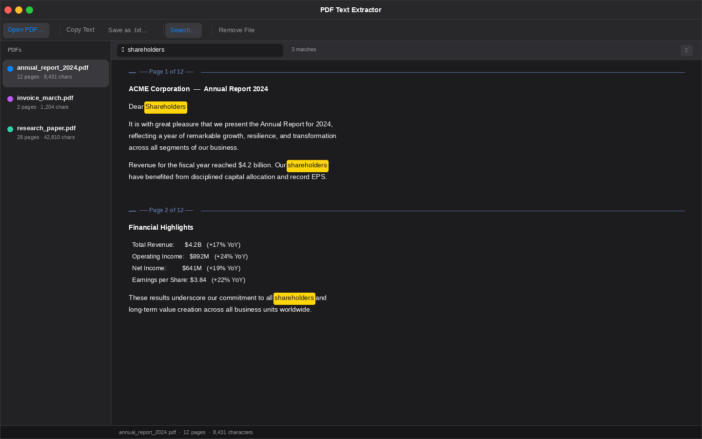

# PDF Text Extractor

A beautiful, **100% offline** macOS desktop app for extracting text from PDF files.



---

## For clients — install in 30 seconds

1. Download `PDFTextExtractor.app` (or the `.zip` containing it) from the [Releases](https://github.com/Aiduckman/ChatReadyPDF/releases) page.
2. Drag **PDFTextExtractor.app** into your **Applications** folder.
3. The very first time you launch it: **right-click the app → Open**, then click **Open** in the dialog.
   *(macOS shows that warning for any app that isn't notarized by Apple. It's a one-time click — after that it opens normally from Launchpad/Spotlight.)*

That's it. No Python, no Terminal, no `pip install`. The app is fully self-contained (~120 MB) and runs entirely offline — your PDFs never leave your Mac.

> **Requires macOS 11 (Big Sur) or newer, Apple Silicon or Intel.**

---

## Features

| Feature | Description |
|---|---|
| **Drag & Drop** | Drop PDFs directly onto the window |
| **Open dialog** | ⌘O — open one or many PDFs at once |
| **Multi-file sidebar** | Switch between docs instantly |
| **Page markers** | Text is split by page for easy navigation |
| **Search** | ⌘F — highlights all matches in yellow |
| **Copy text** | ⇧⌘C — copy all extracted text to clipboard |
| **Save as .txt** | ⌘S — save extracted text as a plain-text file |
| **Remove file** | ⌘W — remove current doc from the list |
| **Show in Finder** | Right-click any sidebar item |
| **Dark mode** | Automatically follows system appearance |
| **Background loading** | Large PDFs load without freezing the UI |

### Keyboard shortcuts

| Shortcut | Action |
|---|---|
| ⌘O | Open PDF(s) |
| ⌘F | Show search bar |
| Escape | Close search bar |
| ⇧⌘C | Copy extracted text |
| ⌘S | Save as .txt |
| ⌘W | Remove current file |

---

## For developers — building the .app

You only need to do this if you want to rebuild the bundle yourself (after editing the code, bumping the version, etc.).

### One command

```bash
cd build_app
./build_app.sh
```

The script handles everything:

- Picks a compatible Python (3.10–3.12 from Homebrew)
- Creates an isolated build venv at `build_app/.venv/`
- Installs **PyInstaller**, **PyQt6**, and **PyMuPDF**
- Generates `AppIcon.icns` from `AppIcon.png`
- Runs PyInstaller against `PDFTextExtractor.spec`
- Outputs `dist/PDFTextExtractor.app`

First run takes ~1–2 minutes (downloads ~150 MB of build deps). Subsequent rebuilds reuse the cached venv and take ~20 seconds.

### Requirements

- macOS 11+ with Command Line Tools (`xcode-select --install`)
- Python 3.10, 3.11, or 3.12 (`brew install python@3.12`)

### Run from source instead (for quick iteration)

```bash
chmod +x run.sh
./run.sh
```

`run.sh` installs PyMuPDF + PyQt6 into your active Python env and launches the script directly — handy while editing `pdf_text_extractor.py`.

---

## SwiftUI / Xcode version (alternative — fully native)

The `SwiftUI_Xcode/` folder contains a SwiftUI + PDFKit version of the app. PDFKit ships with macOS, so this version has zero runtime dependencies and the resulting binary is only ~2–5 MB.

To build it:

1. Open **Xcode** → File → New → Project → macOS → App
2. Name it `PDFTextExtractor`, set Interface to **SwiftUI**, Language to **Swift**
3. Delete the auto-generated `ContentView.swift`
4. Drag all four `.swift` files from `SwiftUI_Xcode/` into the project
5. Press **⌘R**

Requires Xcode 14+ and macOS 13+.

---

## How the Python version works

PDF text extraction uses **PyMuPDF** (the `fitz` library) — one of the fastest and most accurate PDF parsing libraries available. It pulls the actual text layer embedded in the PDF, so no OCR is needed for normal digital PDFs. Scanned-only PDFs without an embedded text layer will show "(No extractable text found)".

The SwiftUI version uses Apple's **PDFKit** framework, which ships with macOS and does the same thing natively.

---

## Distributing to clients

Inside `dist/` after a build you'll find `PDFTextExtractor.app`. To send it to a client:

```bash
cd dist
zip -ry PDFTextExtractor.zip PDFTextExtractor.app
```

Then upload the `.zip` to a GitHub Release (or email/share it directly). Clients unzip and follow the three install steps at the top of this README.

> **Want to skip the right-click→Open step on clients' Macs?** That requires Apple notarization, which requires an Apple Developer account ($99/year). The build script has a clearly marked place to plug in a Developer ID — see `build_app/build_app.sh`.

---

## Repo layout

```
ChatReadyPDF/
├── pdf_text_extractor.py        ← Main app source
├── requirements.txt             ← PyMuPDF + PyQt6
├── run.sh                       ← Run from source (developer convenience)
├── AppIcon.png                  ← Source icon
├── ui_preview.png               ← Screenshot used in README
├── generate_assets.py           ← Helper for regenerating screenshots
├── build_app/
│   ├── PDFTextExtractor.spec    ← PyInstaller config
│   ├── build_app.sh             ← One-command builder
│   ├── AppIcon.icns             ← Generated by build_app.sh (gitignored)
│   └── .venv/                   ← Build venv (gitignored)
├── dist/                        ← Build output (gitignored)
│   └── PDFTextExtractor.app
└── SwiftUI_Xcode/               ← Alternative native version
    ├── PDFTextExtractorApp.swift
    ├── DocumentStore.swift
    ├── ContentView.swift
    ├── SidebarView.swift
    └── TextDetailView.swift
```

---

## License

MIT. See [`LICENSE`](LICENSE).
